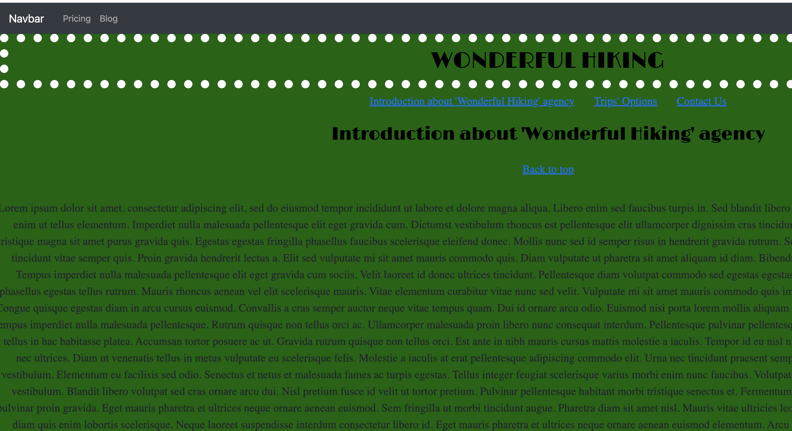

# Routing Exercise

## Description
In this exercise, we learnt how to use routing to make more dinamic the navigation among sections within the same page. We learnt the advantage of Single-Page Applications (SPA) over Multiple-Page Applications (MPA). The example shown is about a fictitious Hiking agency website. You can navigate to their different sections and go back to the page top through links. This naviation is very fast, because we use routing method. Also, you can navigate to other pages (pricing and blog).

## Image

